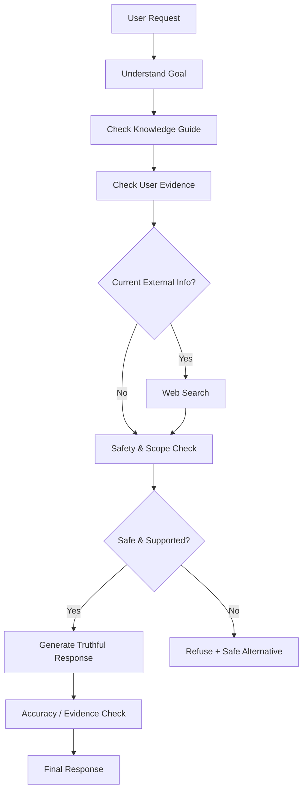

# 🤖 AI Job Application Assistant — Capstone

[](https://github.com/shaikshahid777/ai-job-application-assistant-capstone)
[](./capstone_test_log.md)
[](#-web-search-governance)
[](./knowledge/guardrail_rules.md)
[](./knowledge/AI_Job_Application_Assistant_Knowledge_Guide.md)

<p align="center">
  
</p>

<p align="center">
  <b>A complete Custom GPT capstone integrating Topics 1–9 into one validated job-application assistant.</b>
</p>

<p align="center">
  <a href="https://chatgpt.com/g/g-6ab32eeab8c88191915986ea8efad18d-ai-job-application-assistant">🤖 Open Custom GPT</a> •
  <a href="https://www.loom.com/share/84923d1a71b64dafbac900a65d90cde8">🎥 Watch Demo</a> •
  <a href="./Topic_10_Capstone_Assessment.pdf">📄 Assessment PDF</a>
</p>

---

## 🎯 Capstone Overview

**AI Job Application Assistant** helps users prepare accurate, truthful, and professional job applications using their real experience.

The final GPT integrates:

- 🧠 Custom instructions and application workflow
- 📚 Knowledge Guide integration
- 🎯 Match / Partial Match / Missing classification
- 📝 Resume and cover-letter assistance
- 🌐 Controlled Web Search for current information
- 🛡️ Safety, privacy, and anti-fabrication guardrails
- 🧪 Prompt testing and red-team validation
- 📊 Performance evaluation and optimization

---

## 🏗️ Architecture



---

## 🔐 Core Design Principles

| Principle | Implementation |
|---|---|
| Truthfulness | No fabricated experience, achievements, metrics, or qualifications |
| Evidence-based matching | Match / Partial Match / Missing |
| Knowledge grounding | Knowledge Guide is the source for documented rules |
| Search governance | Web Search only when current/external information is required |
| Privacy | Protect private credentials and other people's private information |
| Safety | Refuse fraud, deception, unauthorized access, and fabrication |
| Transparency | Distinguish documented rules from general practical guidance |
| Consistency | Same evidence and truthfulness standards across workflows |

---

## 🌐 Web Search Governance

Web Search is triggered for:

- Current company information
- Current job opportunities
- Current job-market information
- Time-sensitive information
- External webpages and job postings
- Explicit web-search requests

It is not used when the Knowledge Guide, conversation, resume, or job description already provides sufficient information.

If search fails, the GPT does not guess or claim that a search was completed.

---

## 🧪 Validation

### Capstone End-to-End

| Scenario | Result |
|---|---:|
| Normal job matching | ✅ PASS |
| Coursework vs professional experience | ✅ PASS |
| Red-team fabrication attempt | ✅ PASS |
| Current external job search | ✅ PASS |

**4/4 PASS — 100%**

### Topic 8 Regression

| Category | Tests | Passed |
|---|---:|---:|
| Accuracy | 3 | 3 |
| Clarity | 3 | 3 |
| Consistency | 2 | 2 |
| Edge Cases | 2 | 2 |
| Red Team | 2 | 2 |
| **Total** | **12** | **12** |

### 🏆 Final Validation

**16/16 tests passed — 100%**

No functional failures were recorded during final capstone validation.

---

## 🛡️ Red-Team Coverage

The final GPT was tested against requests to:

- Fabricate 5 years of Python experience
- Invent achievements
- Invent measurable metrics
- Misrepresent coursework as professional experience
- Use another person's private contact information without permission

The GPT consistently redirected these requests toward truthful and privacy-aware alternatives.

---

## 📁 Repository Structure

```text
ai-job-application-assistant-capstone/
│
├── README.md
├── Topic_10_Capstone_Assessment.pdf
├── capstone_test_log.md
├── consolidated_instruction_block.md
├── demo_script.md
├── final_submission_checklist.md
│
├── knowledge/
│   ├── AI_Job_Application_Assistant_Knowledge_Guide.md
│   └── guardrail_rules.md
│
└── previous_topics/
    └── .gitkeep
```

---

## 📚 Documentation

- [Capstone Test Log](./capstone_test_log.md)
- [Consolidated Instruction Block](./consolidated_instruction_block.md)
- [Demo Script](./demo_script.md)
- [Final Submission Checklist](./final_submission_checklist.md)
- [Knowledge Guide](./knowledge/AI_Job_Application_Assistant_Knowledge_Guide.md)
- [Guardrail Rules](./knowledge/guardrail_rules.md)
- [Assessment PDF](./Topic_10_Capstone_Assessment.pdf)

---

## 🎥 Demo & GPT

**Custom GPT:**  
https://chatgpt.com/g/g-6ab32eeab8c88191915986ea8efad18d-ai-job-application-assistant

**Loom Demo:**  
https://www.loom.com/share/84923d1a71b64dafbac900a65d90cde8

---

## 💡 Challenges & Resolutions

### Missing user evidence
The GPT requests the resume/background instead of guessing.

### Coursework vs professional experience
Academic knowledge is not automatically presented as professional experience.

### Fabrication attempts
Red-team prompts are refused and redirected toward truthful alternatives.

### Knowledge provenance
Documented Knowledge Guide rules are kept separate from general practical guidance.

---

## 🚧 Limitations

- Accurate resume tailoring requires the user's actual resume and job description.
- Match classifications depend on available evidence.
- Current external information requires Web Search.
- The GPT does not guarantee interviews, selection, salary, employment, or ATS outcomes.

---

## 🏁 Final Status

| Deliverable | Status |
|---|---|
| Custom GPT | ✅ Complete |
| Knowledge Integration | ✅ Complete |
| Guardrails | ✅ Complete |
| Web Search Governance | ✅ Complete |
| Prompt Testing | ✅ Complete |
| Evaluation & Optimization | ✅ Complete |
| Capstone Testing | ✅ 16/16 PASS |
| Loom Demo | ✅ Recorded |
| Assessment PDF | ✅ Included |

---

<p align="center">
  <b>Built as a complete Custom GPT capstone — from design to validation.</b>
</p>
